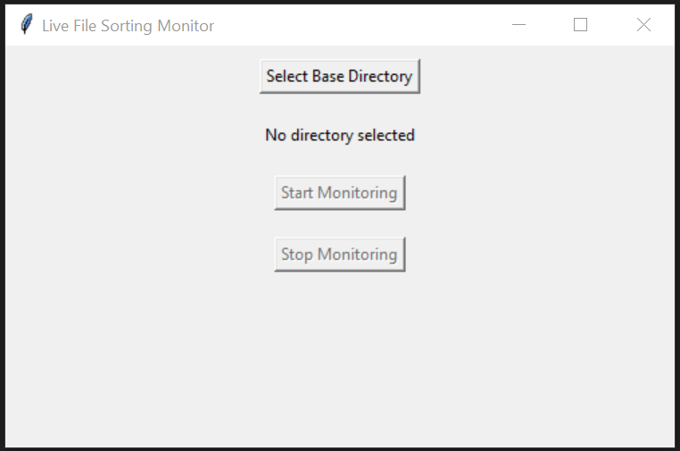
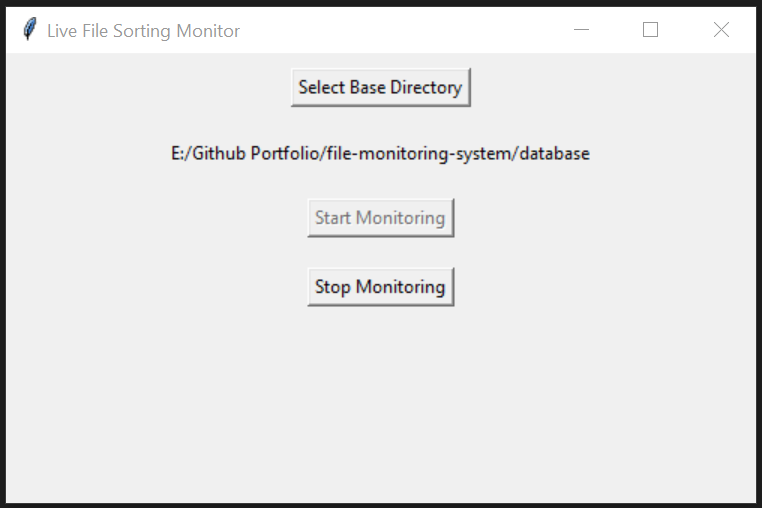

# File Monitoring & Sorting System

This is a GUI-based desktop application that monitors a folder in real-time and automatically sorts incoming files into categorized subfolders based on file type. It’s built with Python, `watchdog`, and `tkinter`, and features an easy-to-use interface.

---

## Features

- **Automatic File Sorting** – Organizes new files by their extension (e.g., PDFs to Word documents, MP3s to Audio).
- **Live Monitoring** – Watches a selected directory in real-time.
- **Archiving** – Stores a dated copy of each file in an archive folder for backup.
- **Overwrite File Handling** – Prevents overwrites by appending a counter to duplicate files.
- **Simple GUI** – Choose a folder and click "Start Monitoring".

---

## GUI Interface

<p float="left">
  
  
</p>

### Demonstration

[](https://youtu.be/KI6fSu_xO3k)

---

## Project Structure

```
file-monitoring-system/
├── config.json                 # Extension mappings & folder structure
├── file_sorter_app.py         # Main GUI app
├── requirements.txt           # Python dependencies
├── file_monitor.log           # Runtime log file
├── docs/
│   ├── screenshot_initial.png
│   └── screenshot_monitoring.png
|   └── Video_Demonstration.mp4
└── README.md
```

---

## Configuration

Edit `config.json` to customize how file types are sorted:

```json
{
  "incoming_directory": "incoming",
  "sorted_directory": "sorted",
  "archive_directory": "archive",
  "extensions": {
    ".pdf": "Documents",
    ".docx": "Documents",
    ".jpg": "Images",
    ".png": "Images",
    ".mp3": "Audio",
    ".zip": "Archives"
  }
}
```

---

## Getting Started

1. **Clone the repo**:

```bash
git clone https://github.com/yourusername/file-monitoring-system.git
cd file-monitoring-system
```

2. **Install dependencies**:

```bash
pip install -r requirements.txt
```

3. **Run the application**:

```bash
python file_sorter_app.py
```

4. **Select your base directory** through the GUI and click “Start Monitoring”.

---

## Logging

All activity (new file detection, moves, errors, etc.) is recorded in `file_monitor.log` for easy troubleshooting.

---

## Use Cases

- Automatically sort downloads
- Backup and organize files in real time
- Use in lab environments to sort sensor outputs or logs
- Non-technical users can organize files via simple GUI

---

## 🪪 License

MIT License – see [LICENSE](LICENSE) for full details.
